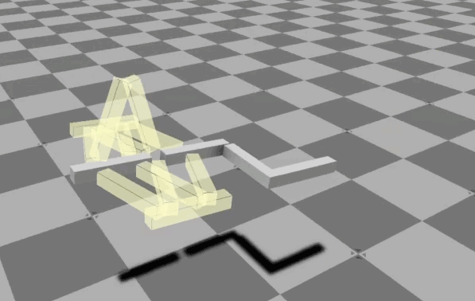

# O3DE Physics tests - Manipulator PoC Issues and Solutions/Workarounds

|   | 
| --| 
|For a general description and running instruction refer to [README](../README.md) |

## Issues and Solutions/Workarounds

### 1. Physics simulation stability

#### Issue

When using the default setting of physics parameters, major problems with stability were observed. These problems were identified and described in [initial feasibility tests](Initial_Feasibility_tests.md).

#### Solution

To eliminate these problems with physics, the following changes to the default configuration were done:
- Global physics configuration: 
    - `Max Time Step: 0.01`
    - `Fixed Time Step: 0.001`
- Solver iterations for the `rail_X` entity: `Position: 40`, `Velocity: 10`

These parameters were set experimentally, and most probably may be further tuned. 

### 2. Manipulator design - joints

#### Issue

The apple picking manipulator is designed around a set of prismatic joints – rails and sliders providing movement in 3 DOF. However, currently, only rotational joints are implemented in O3DE, making an accurate representation of the manipulator in the simulation impossible.

#### Workaround

This task aimed to design a mechanism consisting of available physics elements imitating the prismatic joint. The main assumptions were:
-   The design should be as simple as possible, consisting of as few elements as possible.
-   The design should provide proper stiffness to minimize vibrations.

After preliminary tests, the following conclusions were made:

The prismatic joint can be simulated in a straight-forward way (from the technical point of view) building a slider–rail mechanism based on surface contact only. 

Pros:
-   Such solution works well in terms of transition. It’s relatively easy to create a mechanism that blocks transitions in 2 directions, allowing movement in the 3rd one.
-   There’s no way of setting damping directly, however it can be substituted (kind of) by setting friction properly.  

Cons:
-   Blocking rotations in this emulation of prismatic joint cause some problems. It is especially severe if using larger momentum (large range of movement, long arms). This problem can be solved by using additional slider-rail “joints” on long arms, which makes the mechanism complicated.
-   Such solution is prone to instabilities and vibrations resulting from the backlash of the mechanism. These issues relate on clearances, which are hard to tune.
-   There’s no direct way of setting stiffness or damping. 

The prismatic joint can be emulated using hinge joints only. 

|  |
|:--:| 
| *Emulating prismatic joint using hinge joints* |

Pros:
-   Stiffness and damping can be added to hinge joints.
-   It handles rotation quite well, and transitions a bit worse, but acceptably.

Cons:
-   Mechanism is quite complicated. To allow sufficient stiffness, additional elements should be added, making it even more complicated.
-   Stiffness and damping depend on the angle of hinge joint rotation, not the linear position of the slider.

Considering these conclusions, a hybrid approach was chosen, with 2 contact-based sliding joints on 2 ends of the movement range and 2 hinge-based arm mechanisms. Sliding joints prevent transition and rotation around axes perpendicular to the rail, hinge arms stabilize the mechanism and prevent the rotation axis of the rail.

|  |
|:--:| 
| *Emulating prismatic joint - hybrid approach* |

