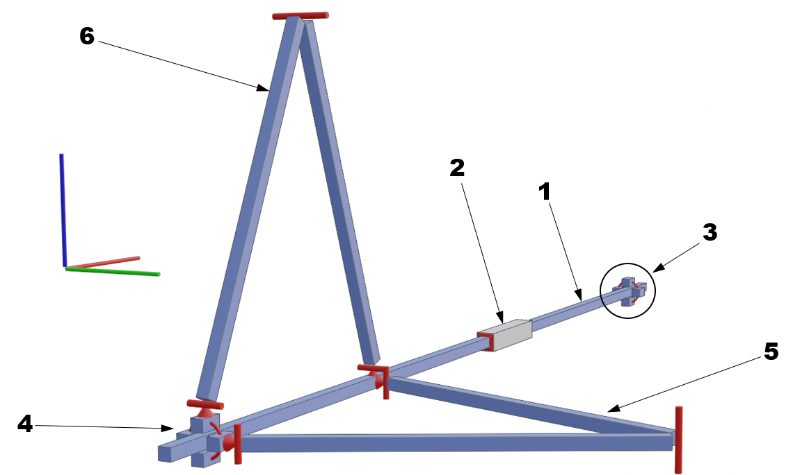
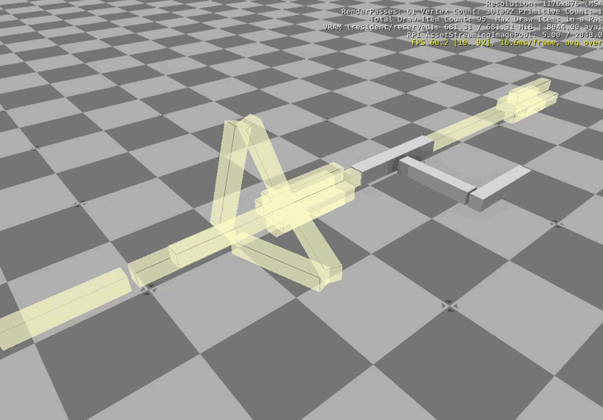

# O3DE Physics tests - Manipulator PoC Technical Details

|   | 
| --| 
|For a general description and running instruction refer to [README](../README.md) |
|To read about issues and solutions/workarounds refer to [this document](Manipulator_Issues.md) |

## Model Structure

The apple picking manipulator is designed around a set of prismatic joints – rails and sliders providing movement in 3 DOF. However, currently, only rotational joints are implemented in O3DE, making an accurate representation of the manipulator in the simulation impossible. Refer to [this document](Manipulator_Issues.md) to see a description of the issue and the results of the initial experiments.

A workaround is a set of rigid bodies connected with hinge joints and surface contact forces. Emulated prismatic joint for 1 DOF has following structure:

|  |
|:--:| 
| *Manipulator model structure - one DoF* |

### Model elements

|   |   |
| --| --|
| 1 | Sliding bar | 
| 2 | Manipulator element, connected with the sliding bar `1` with a fixed joint | 
| 3,&nbsp;4 | Two slider guides, consist of 4 elements surrounding the sliding bar `1`. All elements are connected with fixed joints. Both guides are located on opposite ends of the sliding range and are fixed to the base element with a fixed joint. |
| 5 | Horizontal stabilization arms. 2 arms connected together with a hinge joint. One end is connected with a hinge joint to the slider guide `3`, the other to the sliding bar `1`. The joint connecting both arms has a hard limit configured to limit the range of the sliding arm movement. No other constraints are set. |
| 6 | Vertical stabilization arms. 2 arms connected together with a hinge joint. One end is connected with a hinge joint to the slider guide `3`, the other to the sliding bar `1`. No constraints are set. |

Slider guides prevent movement in Y and Z directions and rotations around these axes. Stabilization arms are used to stabilize rotation around all 3 axes and limit the range of slider movement. Damping and stiffness of hinge joints were not used, because these parameters are hard to be tuned to work predictably in the whole range of movement. It should be however considered to use, at least damping, e.g. by applying it to different joints simultaneously. 

|  |
|:--:| 
| *Prismatic joint emulation* |

The mechanism described above was used for 2 DOF of the manipulator: movement along the X axis (along the vehicle) and the Z axis (vertical). The last part of the apple picking manipulator is a gripper, moving along the Y axis. This is a relatively light element, not supposed to be subjected to large forces. Thus, stiffness is not as crucial as in the case of other DOFs, so it was decided to implement a simpler mechanism, consisting only of contact-based sliding elements. It has a form of a slider guide (similar to slider guides `3` and `4` from the structure described above) moving along the slider rail, fixed to other parts of the manipulator. This mechanism is also equipped with 2 designed to limit slider movement range.

The construction of the full manipulator was shown in the following image:

|  |
|:--:| 
| *Structure of the apple picking robot manipulator* |

## Physics settings 

### Material properties of sliders

The `slider.physxmaterial` material is applied to all sliding surfaces of emulated joints. It uses the following parameters:
-   `Dynamic friction: 0.1`
-   `Static friction: 0.0`
-   `Restitution: 0.0`

Friction parameters were set experimentally to minimize oscillations. Restitution was set to `0` to minimize instabilities caused by impacts between surfaces. 

### Tuning of physics parameters

To eliminate problems with physics described in the following sections, the following changes to the default configuration were done:
- Global physics configuration: 
    - `Max Time Step: 0.01`
    - `Fixed Time Step: 0.001`
- Solver iterations for the base element: `Position: 10`, `Velocity: 4`

These parameters were set experimentally, and most probably may be further tuned. 

### Mass properties

Oscillations and instabilities of the manipulator mechanism are related to inertia, which are related to the masses of components of the mechanism. In theory, minimizing masses could help minimize oscillations and increase overall stiffness. However small masses are prone to numerical instabilities. Therefore, masses of all rigid bodies were calculated automatically by O3DE based on collision shapes. However, in all cases, gravity influence was turned off. The main reason for this was to assist in tuning controller parameters. 

### Collision groups

Most of the elements constituting the manipulator mechanism serve only the purpose of prismatic joint emulation and must not affect the movements of other objects on the scene. To assure this, for all objects where it was possible, collisions were disabled by setting `Collides With: None` in physics collider options. O3DE system of collision layers and groups was used to allow collision of objects, where collision is crucial (sliding bars, guides, etc.). All these objects were grouped into 3 collision layers: `L1`, `L2`, and `L3` (depending on the DOF). It was also defined, that all objects from layer `L1` may collide only with group `G1`, from `L2` with `G2`, and from `L3` with `G3`. At the same time, `L1` was linked only with `G1`, `L2` with `G2`, and `L3` with `G3` (which was set in PhysX Configuration). All other objects on the scene shouldn’t lay on any of these 3 collision layers, so they won’t collide with any of the manipulator objects.

## The controller

The manipulator controller is in the `manipulator_control_test.lua` file. Its goal is to set manipulator sliders in desired positions. Movement in each DOF is forced by a force impulse (RigidBodyRequestBus.Event.ApplyLinearImpulse). The value of this impulse is calculated using the PID controller – separate for each DOF. The LUA code for the PID controller was based on code from [this forum](https://steamcommunity.com/sharedfiles/filedetails/?id=1800568163). The parameters for each controller were set experimentally, and are as follows:

|   | P | I | D |
| -- | -- | -- | -- |
| X direction | 10.0 | 0.1 | 200.0 |
| Y direction | 10.0 | 10.0 | 200.0 |
| Z direction | 30.0 | 0.0 | 300.0 |

The force impulse is calculated in each frame by providing the expected slider position and current one into the PID controller. To include the influence of simulation framerate, computation takes into account the time that has passed since the last timestep `delta_time`. The force impulse is calculated using the following equation:

`force = pid:run(expected_position, current_position) * delta_time * 10.0`

In the case of the last DOF (Y-direction slider), the force is divided by 10, due to the much smaller mass of moving elements.

Tuning PID parameters is a tricky task and must be performed after each modification of the manipulator configuration of parameters. An additional parameter to be considered in this task is related to the friction of sliders. 

The expected position is set using arrow keys (for X and Z direction) and space key by switching between predefined values. 

