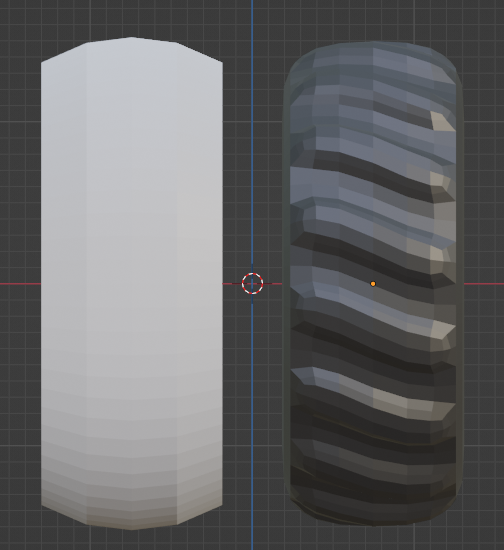

# O3DE Physics tests - Mobile Robot Issues and Solutions/Workarounds

|   | 
| --| 
|For a general description and running instruction refer to [README](../README.md) |
|For a technical details refer to [this document](Mobile_Robot_Technical_Details.md) |

## Issues and Solutions/Workarounds

### 1. Physics simulation stability

#### Issue

When using the default setting of physics parameters, major problems with stability were observed. These problems were identified and described in [initial feasibility tests](Initial_Feasibility_tests.md).

#### Solution

To eliminate these problems with physics, the following changes to the default configuration were done:
- Global physics configuration: 
    - `Max Time Stape: 0.01`
    - `Fixed Time STape: 0.001`
- Solver iterations for the chassis (entity `mobile_robot`): `Position: 10`, `Velocity: 4`

These parameters were set experimentally, and most probably may be further tuned. 

### 2. Suspension design - joints

#### Issue

Real vehicles use different types of suspension. In the vast majority of cases, they can be described as a set of rigid bodies connected with two types of joints: rotational (can be simplified as 1D hinge-type joint) and prismatic joints. Prismatic joints may simulate spring and damper with appropriately set damping and stiffness parameters. Since these joints effectively block all rotations and movement in all DOF except one, the whole suspension is often simplified to just one prismatic joint per wheel (like it is done in [PhysX Vehicle simulation](https://docs.nvidia.com/gameworks/content/gameworkslibrary/physx/guide/Manual/Vehicles.html)). However, currently, there are only rotational joints implemented in O3DE, which is insufficient to create the simplified version of suspension, as well as a realistic one with a representation of all elements of the real suspension.

#### Workaround

Hinge-type joints implemented in the O3DE can have a rotation limit with stiffness and damping properties. It can be used as a substitute for the prismatic joint. This solution has however some drawbacks. To keep the wheel alignment and prevent camber while it moves up and down, two suspension arms must be used (like in the [double wishbone suspension](https://en.wikipedia.org/wiki/Double_wishbone_suspension)). This makes the design more complicated, and prone to problems with stability. Because of this issue, a simpler solution has been chosen for the PoC, with only one suspension arm per wheel ([swing axel suspension](https://en.wikipedia.org/wiki/Swing_axle)). This however raises other problems: the steering rod must consist of 2, properly aligned parts (see issue #4). 

Refer to the [design description](Mobile_Robot_Technical_Details.md) for design details.

Initial tests show, that despite these issues, this type of suspension is sufficient as the first iteration of mobile robot simulation.

### 3. Tires

#### Issue

Simulation of contact between tires and ground is a complicated task. With the initial set of default parameters (rubber and cylindrical wheel collision shape), wheels were wobbling and jumping. 

#### Solution

Two solutions were applied:

1.  Tire rubber physics material was altered. Restitution was set to 0.0, and “restitution combine” was set to “minimum” (to force using 0.0 all the time). At the same time, both friction coefficients were set to 1.0
2.  Wheels are tilted most of the time. The collision shape was changed from cylindrical to more realistic, with a convex rolling surface.

|  |
|:--:| 
| *Wheel collision shape (left) and wheel mesh (right)* |

### 4. Steering

#### Issue

Steering (rotation of steering knuckles) is applied to each wheel separately. However, occasionally e.g., when hitting an obstacle or during a ride on bumpy terrain, wheels tended to have independent rotations. This might cause some wobbling. 

#### Solution

To prevent these problems, both knuckles were connected by steering rods. Since the rotation axes of knuckle joints J2 are not parallel due to the rotation of swing arms, steering rods are connected with additional joint J5. Since parameters of this joint have an impact on the overall behavior of the front suspension, its stiffness was set to a much lower value than the stiffness of the swingarm joint J1. It should be considered however to tune parameters of all joints in front suspension (e.g. by reducing the stiffness of J1 joints). 

See [this document](Mobile_Robot_Technical_Details.md) for details.

