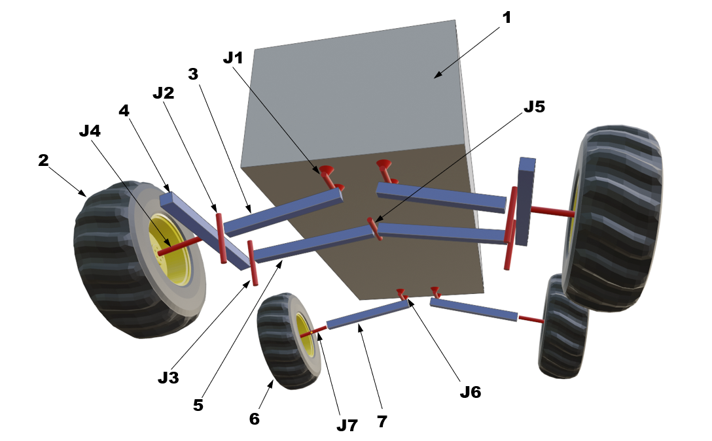
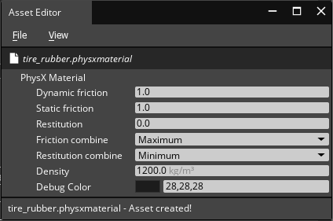
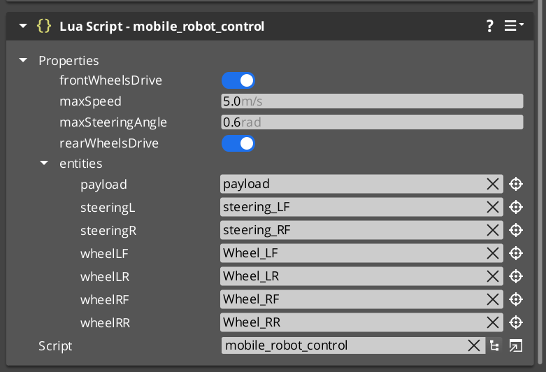

# O3DE Physics tests - Mobile Robot Technical Details

|   | 
| --| 
|For a general description and running instruction refer to [README](../README.md) |
|To read about issues and solutions/workarounds refer to [this document](Mobile_Robot_Issues.md) |

## Model Structure

Suspension of the vehicle was created using rigid body swing arms connected to the chassis with hinge joints. These joints have applied stiffness and dumping to hold the vehicle. Front wheels are additionally equipped with steering knuckles, connected by hinge joints to arms. These joints have stiffness and damping as well, to force the wheel to rotate to the neutral position.

|  |
|:--:| 
| *Mobile robot model structure* |

### Rigid body elements

|   |   |   |
| --| --| --|
| 1 | Chassis | Mass: 40.0 kg  Dimensions: 0.82x0.3x0.15 m |
| 2 | Front wheel | Mass: 3.0 kg  Diameter: 0.3 m Physics material: tire_rubber (see below) |
| 3 | Front swing arm | Mass: 1.0 kg |
| 4 | Steering knuckle | Mass: 1.0 kg |
| 5 | Steering rod | Mass: 1.0 kg |
| 6 | Rear wheel | Same as front wheel |
| 7 | Rear swing arm | Mass: 1.0 kg |

### Joints

|   |   |   |
| --| --| --|
| J1 | Chassis -> Front swingarm |  Limit: +/- 0.1 deg Damping: 70.0 Stiffness: 500.0 |
| J2 | Swing arm -> Steering knuckle |  Limit: +/- 0.1 deg Damping: 70.0 Stiffness: 0.001 |
| J3 | Steering rod -> Steering knuckle |   No limits |
| J4 | Steering knuckle -> Wheel |  No limits |
| J5 | Left steering rod -> Right steering rod | Limit: +/- 0.1 deg Damping: 100.0 Stiffness: 100.0 |
| J6 | Chassis -> Rear swingarm |   Same as J1 |
| J7 | Steering knuckle -> Wheel |  Same as J4 |

## Physics settings 

### Tire rubber material

This material is applied to all tires. Parameters were tuned for maximal stability of contact. 

Tire model parameters:

|  |
|:--:| 
| *Tire rubber material properties* |

### Tuning of physics parameters

To eliminate problems with physics described in the following sections, the following changes to the default configuration were done:
- Global physics configuration: 
    - `Max Time Step: 0.01`
    - `Fixed Time Step: 0.001`
- Solver iterations for the chassis (entity `mobile_robot`): `Position: 10`, `Velocity: 4`

These parameters were set experimentally, and most probably may be further tuned. 

## The controller

Vehicle controller is in the mobile_robot_control.lua script. It pursues two objectives: to maintain the target steering angle and to maintain the target vehicle speed. In the proof-of-concept example, both target values are applied by pressing arrow keys, it should be however relatively easy to set these values directly, by calling proper functions.

|  |
|:--:| 
| *Mobile robot controller parameters (`robot chassis -> Entity Inspector`)* |

### Steering angle

The steering angle is set by rotating steering knuckles around joint J2. In the case of each knuckle, the controller reads current rotation and applies torque impulse (`ApplyAngularImpulse`) calculated based on the difference between expected and current angles. At the current stage, the controller value of this impulse is calculated using the following equation:

`torque = (10.0 * (target_angle – current_angle)) ^3`

**Note:** It should be considered to apply a more advanced controller, e.g. PID.

The target steering angle is set by pressing side arrows on the keyboard. When the arrow key is pressed, the target angle is set to +/- `maxSteeringAngle` (sign depends on arrow direction). If none of the side arrows is pressed, the target angle is set to `0.0`. Controller updates knuckle rotation in each run of the OnTick method.

`maxSteeringAngle` can be modified in script settings (`robot chassis -> Entity Inspector`).

### Speed

Vehicle velocity is set by applying torque impulses (`ApplyAngularImpulse`) to drive wheels. The controller reads current velocity and calculates torque based on the difference between target and current target velocities using the following equation:

`torque = 0.05 * (target_speed – current_speed)`

**Note:** It should be considered to apply a more advanced controller, e.g. PID. It should be also considered to use also wheel rotation in the controller, not only vehicle speed. E.g. implement 2 controllers: the first controls wheel angular velocity to achieve the target speed of the vehicle and the second sets torque impulses to achieve this angular velocity. This would allow applying large torque with low angular velocity and implementation of more realistic braking (setting wheel velocity to 0).

The controller may work in front-, rear-, or all-wheel drive configurations. It can be set by switching `frontWheelsDrive` and `rearWheelsDrive` settings in script settings (`robot chassis -> Entity Inspector`).

The target vehicle speed is set by pressing up/down arrows on the keyboard. When these keys are pressed, the target speed is set to +/- `maxSpeed` (sign depends on arrow direction). The controller updates speed only if up/down arrows are pressed. If none of them is pressed no torque is applied, which allows free rolling of the vehicle.
maxSpeed can be modified in script settings (`robot chassis -> Entity Inspector`).

## TODO
- Apply more advanced controllers for speed and steering (e.g. PID). Currently applied controllers (based on the proportional part of PID only) are prone to problems like the constant bias of resultant value (e.g. velocity can never reach the target value).
- It should be considered to use also wheel rotation in the controller, not only vehicle speed. E.g. implement 2 controllers: the first controls wheel angular velocity to achieve the target speed of the vehicle and the second sets torque impulses to achieve this angular velocity. This would allow applying large torque with low angular velocity and implementation of more realistic braking (setting wheel velocity to 0).

