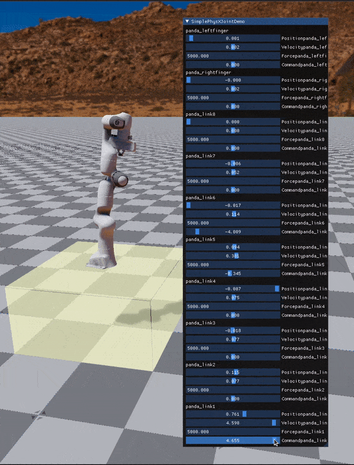
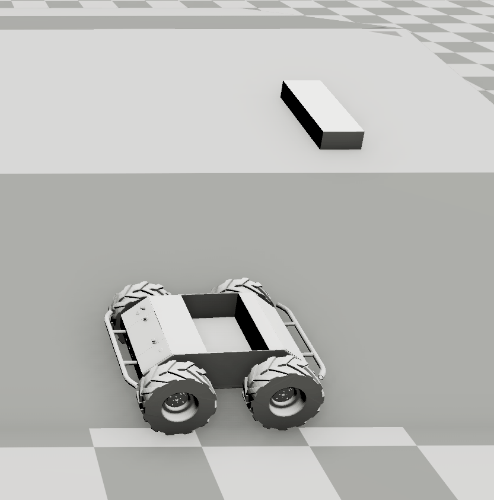
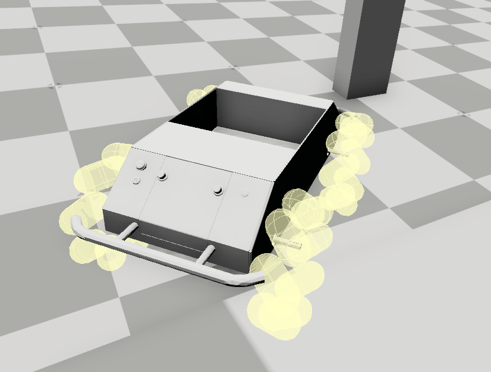
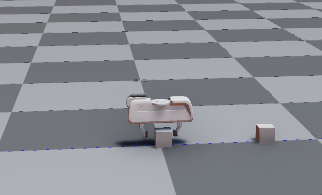

# O3DE Physics tests

***Testing physics in Open 3D Engine***

The purpose of this project is to test the O3DE physics capabilities in the context of robotic simulations. Two main aspects are considered: robot chassis with wheel suspension (mobility) and a manipulator arm.

## Requirements 

- O3DE [from this repository/branch](https://github.com/o3de/o3de)

## Running the demo

Follow the [O3DE ROS Gem README instructions](https://github.com/RobotecAI/o3de-ros2-gem/blob/mecanum_control/README.md) to build O3DE and ROS Gem.

## Contents

The project consists of the following levels:
- [mobile_robot_physics](#robotic_arm) - Robotic Arm
- [mobile_robot_physics](#skid_steering) - Skid Steering
- [mobile_robot_physics](#mecanum_test) - Mecanum test

In addition, the project includes following initial feasibility tests:
- [mobile_robot_physics](Doc/Initial_Feasibility_tests.md#mobile_robot_physics) - Mobile Robot Physics PoC
- [manipulator_physics](Doc/Initial_Feasibility_tests.md#manipulator_physics) - Manipulator Physics PoC 
- [robot_arm_test1](Doc/Initial_Feasibility_tests.md#robot_arm_test1)
- [robot_arm_test2](Doc/Initial_Feasibility_tests.md#robot_arm_test2)
- [mobile_robot1](Doc/Initial_Feasibility_tests.md#mobile_robot1)

# Robotic Arm
Level name `robotic_arm.prefab`

Test level with improted robot using URDF importer. The scene is used to test developed API to PhysX joints.

# Skid Steering
Level name `skid_steering_test.prefab`

Test level with improted robot using URDF importer. The scene is used to test developed API to PhysX joints.

# Mecanum test
Level name `mecanum_test.prefab`

Test level with improted robot using URDF importer. The scene is used to test developed API to PhysX joints.

# Gripper Test
Level name `GripperTest.prefab`

## Initial feasibility tests

[See here](Doc/Initial_Feasibility_tests.md)
